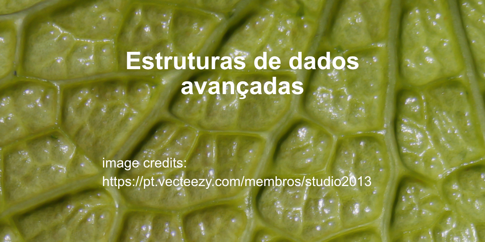

# Estruturas genéricas
## Estruturas de Dados  
  
  
  
Algumas estruturas genéricas em C  
  
Este código foi produzido para responder aos desafios das seguintes unidades curriculares:  
  
LP1 - Linguagens de programação 1  
AED2 - Algoritmos e Estruturas de Dados 2 (EDA - Estruturas de Dados Avançadas)  
  
Estão desenhadas para serem utilizadas com qualquer tipo de dados

## Erros?

Se encontrares algum erro, podes sugerir...  
Todos os contributos são úteis para melhorar ;-)  
Obrigado,  

